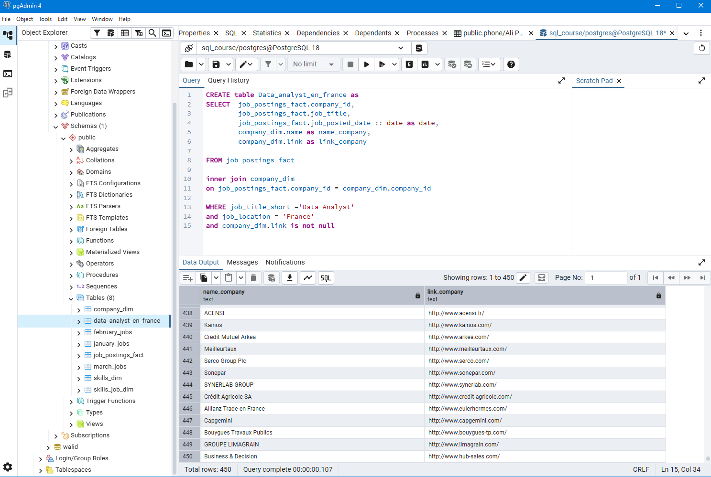
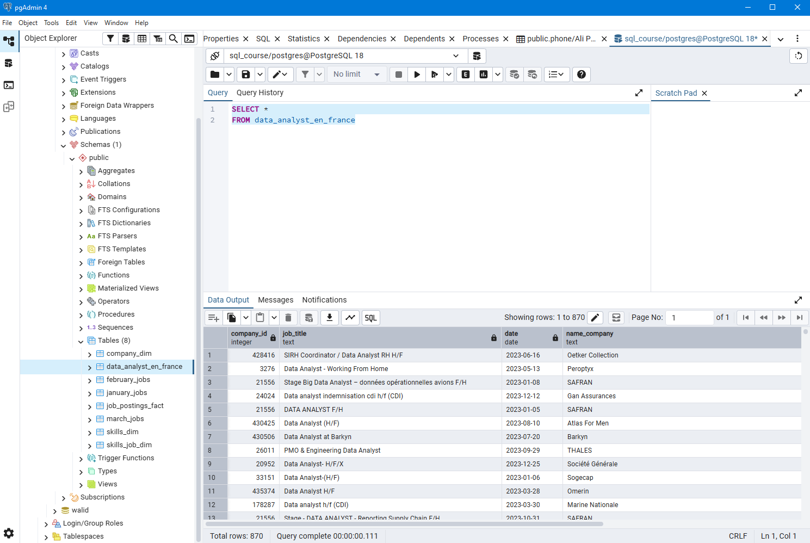
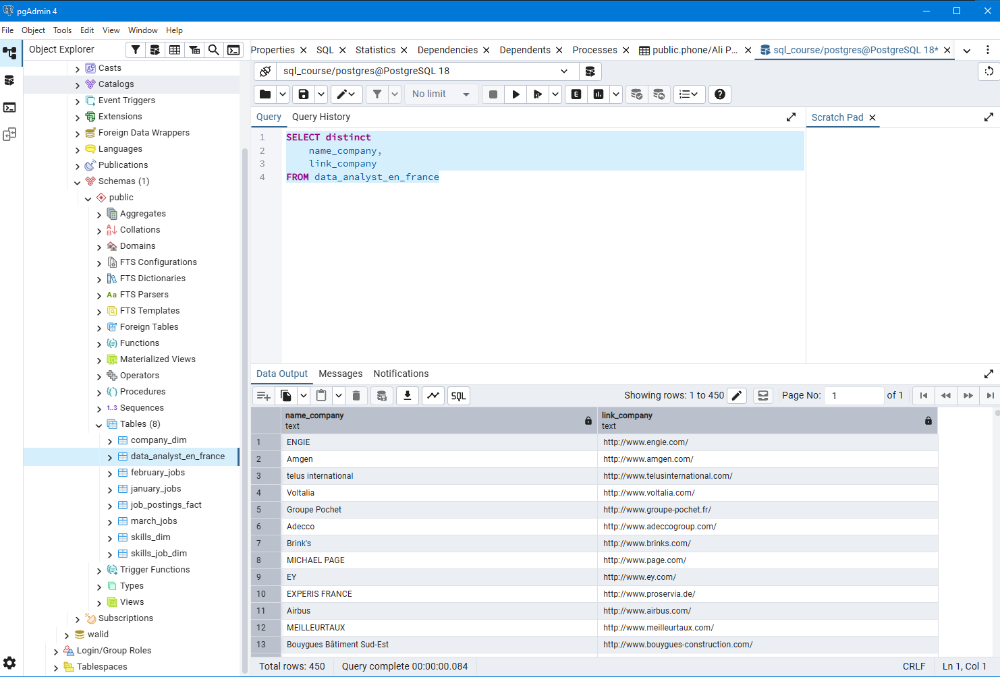

# 📊 Offres d'emploi Data Analyst en France — Projet SQL

## 🧠 Objectif du projet

Ce projet a pour objectif d'extraire et d'analyser les **offres d'emploi de Data Analyst en France** à partir d'une base de données SQL.

L'idée principale est d'identifier les entreprises ayant déjà recruté ou publié des offres pour des Data Analysts, afin de mieux cibler les candidatures spontanées, les stages et les opportunités d'alternance.

---

## 🗄️ Structure des données

Ce projet repose sur deux tables principales :

| Table | Description |
|---|---|
| `job_postings_fact` | Contient les informations des offres d'emploi |
| `company_dim` | Contient les informations des entreprises |

La relation entre ces deux tables est basée sur la clé `company_id`.

---

## 🔗 Requête SQL utilisée

```sql
CREATE TABLE Data_analyst_en_france AS
SELECT
    job_postings_fact.company_id,
    job_postings_fact.job_title,
    job_postings_fact.job_posted_date::date AS date,
    company_dim.name AS name_company,
    company_dim.link AS link_company
FROM job_postings_fact
INNER JOIN company_dim
    ON job_postings_fact.company_id = company_dim.company_id
WHERE job_title_short = 'Data Analyst'
  AND job_location = 'France'
  AND company_dim.link IS NOT NULL;
```

---

## ⚙️ Explication de la requête

### 1. Création de la table

La commande `CREATE TABLE AS` permet de créer une nouvelle table appelée `Data_analyst_en_france`.  
Cette table contient le résultat final filtré et prêt pour analyse.

### 2. Colonnes sélectionnées

| Colonne | Description |
|---|---|
| `company_id` | Identifiant de l'entreprise |
| `job_title` | Titre du poste |
| `date` | Date de publication de l'offre |
| `name_company` | Nom de l'entreprise |
| `link_company` | Site officiel de l'entreprise |

### 3. Jointure des tables

Une jointure `INNER JOIN` est effectuée entre les deux tables :

```sql
job_postings_fact.company_id = company_dim.company_id
```

Cela permet d'enrichir les offres avec les informations des entreprises.

### 4. Filtrage des données

Trois filtres sont appliqués :
- ✅ Uniquement les postes **Data Analyst** (`job_title_short = 'Data Analyst'`)
- ✅ Uniquement les offres situées en **France** (`job_location = 'France'`)
- ✅ Uniquement les entreprises avec un **lien valide** (`company_dim.link IS NOT NULL`)

---

## 📸 Captures d'écran

**Étape 1 — Création de la table et filtrage des données :**



**Étape 2 — Interrogation de la table complète (`SELECT *`) :**



**Étape 3 — Récupération des entreprises uniques avec leurs liens :**



---

## 📌 Résultat final

Le résultat est une table propre et structurée contenant **870 offres d'emploi de Data Analyst en France**, enrichies avec les informations des entreprises.

Un `SELECT DISTINCT` sur `name_company` et `link_company` retourne **450 entreprises uniques**.

Le dataset final est disponible en fichier CSV : [`data_analyst_en_france.csv`](data_analyst_en_france.csv)

---

## 🚀 Utilisation du projet

Ce dataset peut être utilisé pour :

- 📊 Visualisation de données (Tableau, Power BI, etc.)
- 📁 Analyse sur Excel ou autre outil BI
- 🔍 Étude du marché de l'emploi Data Analyst en France
- 🎯 Candidatures spontanées ciblées

---

## 💡 Conclusion

Ce projet permet de mieux comprendre le **marché des Data Analysts en France** et d'identifier les entreprises les plus pertinentes pour des opportunités de stage, d'alternance ou d'emploi.

---

## 🛠️ Outils utilisés

- **PostgreSQL** — Gestion de la base de données
- **pgAdmin 4** — Interface de requêtes SQL
- **SQL** — Extraction et création de tables
